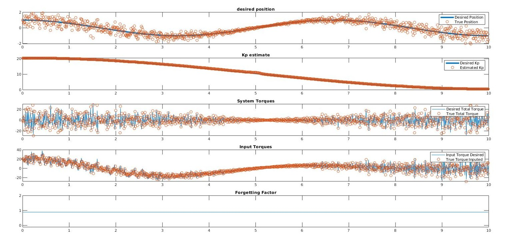

# OCOFF



This repository contains the all the simulation code for the paper written by Alexandre Amice and Raphael Van Hoffelen entitled: "Online Convex Optimization of Forgetting Factor for Recursive Least Squares Estimation of a Time Varying Parameter".

The pdf of the paper is also in this repository and will explain the problem statement and what this simulation is trying to do with results.

## Getting Started

All the simulation code is in the "Simulation" directory. When running the simulation you will get the results saved in a new folder in that same directory.

### Prerequisites

- Matlab

## Running the simulation

Simply add this repository to your path on Mattlab and run the following commad in the console:

```[Matlab]
RunSim(forgeting_factor)
```

The argument passed in is the forgetting factor you want to use during the simulation.

You can also run it with the following argument to get the optimal factor:

```[Matlab]
RunSim("optimal")
```

## Authors

- **Raphael Van Hoffelen** - [github](https://github.com/dskart) - [website](https://www.raphaelvanhoffelen.com/)

- **Alexandre Amice** - [github](https://github.com/AlexandreAmice)

## License

This project is licensed under the MIT License - see the [LICENSE.md](LICENSE.md) file for details.
